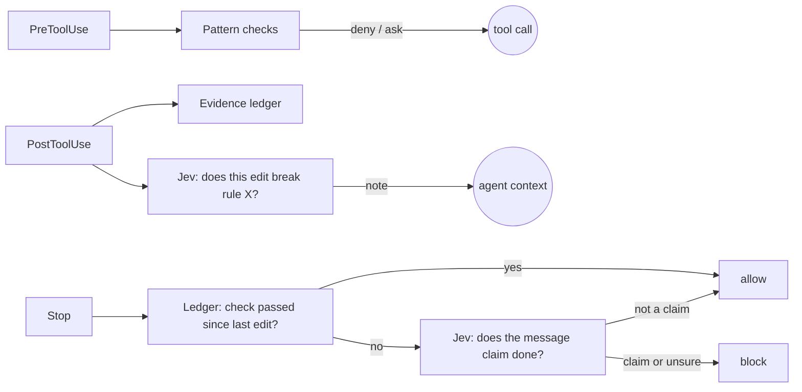

# Canny

A supervision layer for AI coding agents. It hooks into Claude Code and Codex CLI, keeps a ledger of what the agent actually did, and will not let it finish on a claim.

[](https://github.com/qkal/canny/actions/workflows/ci.yml)
[](LICENSE)
[](#install-by-pasting-a-prompt)
[](#claude-code-and-codex-differ-in-four-places)
[](package.json)
[](https://typesafe.ai)
[](https://github.com/qkal/canny/commits/main)

> Done. Skipped tests — one-liner, no branch to break.

That is Claude Code, verbatim, during this project's first live run. It had been asked to add a function, it wrote the file with a shell heredoc, ran nothing, and finished. No error. No warning. Nothing in `CLAUDE.md` could have stopped it, because a rules file only asks the model to remember, and nothing checks that it did.

Canny is the hook that noticed. On the next run of the same prompt, the agent's "done" was refused with this message:

> Canny: math.js changed, but no check has passed since the last edit. The last command was `cat > math.js <<'EOF' …` (exit 0). Run the project's checks and fix what fails before finishing. A test, build, lint, or type-check command counts. If no check applies to this change, say so explicitly and stop again.

Claude ran `npm test`. It passed. The next "done" went through. The whole exchange is in the [session ledger](#what-a-guarded-session-looks-like) below.

## The one rule

**Facts go to code. Judgments go to Jev. Only facts can block.**

A fact is something the ledger can prove: a file changed, a command ran, it exited 1, the same command failed with the same output three times, the text about to be written contains an AWS key. Code decides those, offline, with no API key.

A judgment is something code cannot decide: does this message claim the work is done, does this diff break the rule "never hardcode model IDs". Those go to [Jev](https://typesafe.ai), TypeSafe's decision model, which answers typed yes/no questions with a calibrated probability in about a quarter of a second.

Jev never blocks. A "done" claim is refused because the ledger holds no passing check, not because a probability crossed a line. A rule violation becomes a note in the agent's context, not a wall. When Jev is unsure, or there is no key, the deterministic rule stands alone.

The same session always produces the same verdict, and `canny replay` proves it from the ledger.

## Star History

<a href="https://www.star-history.com/?repos=qkal%2Fcanny&type=date&legend=top-left">
 <picture>
   <source media="(prefers-color-scheme: dark)" srcset="https://api.star-history.com/chart?repos=qkal%2Fcanny&type=date&theme=dark&legend=top-left" />
   <source media="(prefers-color-scheme: light)" srcset="https://api.star-history.com/chart?repos=qkal%2Fcanny&type=date&legend=top-left" />
   
 </picture>
</a>

## Install by pasting a prompt

Canny is not on npm. Your agent installs it from this repository: a clone and one command. The compiled CLI is committed, so there is nothing to build. You need git and Node 22 or newer.

Paste this into Claude Code or Codex, inside the project you want guarded:

```text
Install Canny (https://github.com/qkal/canny), a supervisor that checks your work through this agent's hooks, and hook it into this project.

1. Confirm `node --version` is 22 or newer. If not, stop and tell me.
2. If ~/.canny/src exists, run `git -C ~/.canny/src pull --ff-only`. Otherwise run `git clone https://github.com/qkal/canny.git ~/.canny/src`. There is nothing to build or install.
3. From the root of this project, run `node ~/.canny/src/dist/cli.js init` and show me the hook entries it wrote.
4. Run `echo canny-check`, then `node ~/.canny/src/dist/cli.js status`. If status lists a session with at least one event, the hooks are live. If it says no sessions were recorded: on Claude Code ask me to restart you; on Codex remind me to run /hooks to trust the new hooks.
5. Change nothing else. Tell me what you did in five lines or fewer.
```

`init` writes hook entries for the agents it finds installed, so the same prompt works in either agent. To choose explicitly, change step 3 to `init --claude` or `init --codex`. To guard every project instead of this one, use `init --global`, which writes to `~/.claude/settings.json` and `~/.codex/hooks.json`.

To update later:

```text
Update Canny: run `git -C ~/.canny/src pull --ff-only` and tell me what changed, from its CHANGELOG.md, since the previous commit.
```

To remove it from a project:

```text
Remove Canny from this project: from the project root run `node ~/.canny/src/dist/cli.js remove` and show me what it took out. Leave ~/.canny alone.
```

By hand, the same thing is two commands, and a third if you want a `canny` on your PATH:

```bash
git clone https://github.com/qkal/canny.git ~/.canny/src
node ~/.canny/src/dist/cli.js init
ln -s ~/.canny/src/dist/cli.js ~/.local/bin/canny
```

With `canny` on your PATH, `init` writes `canny hook` into the hook config instead of the absolute path.

## What a guarded session looks like

Every hook event lands in an append-only ledger, one file per session under `~/.canny/sessions/`. This is the live run from the top of the page, as `canny status` and the ledger show it. Only paths and outcomes are stored, never file contents.

```text
event  what happened                                   exit     verdict
Bash   ls -a && cat package.json                       0
Bash   cat math.test.js                                0
Bash   cat > math.js <<'EOF' … EOF                     0        edit recorded: math.js
Stop   "…Done."                                        —        block: math.js changed, no check has passed
Bash   node --test 2>&1 | tail -20                     0        not on the list of checks that day
Stop   "…Done."                                        —        block: still no passing check
Bash   npm test                                        0        a check
Stop   "npm test passes: 1 test, 0 failures … Done."   —        allow
```

`node --test` was not yet on the list of commands that count, so Claude was blocked a second time and reached for `npm test`. The list is [configurable](#configuration), and that one is on it now.

Run `canny replay` on any session and it re-derives every Stop verdict from the recorded facts and the recorded Jev answers, then reports any mismatch. There are none.

## Three hooks carry everything



Claude Code also gets `PostToolUseFailure`, because that is where it reports a command's non-zero exit. Only the pattern checks and the ledger gate can block. Everything Jev says becomes a note.

## What blocks and what only nags

| Check                                                                                                                                                                                                                                                                                  | When        | Decided by | Outcome                                        |
| -------------------------------------------------------------------------------------------------------------------------------------------------------------------------------------------------------------------------------------------------------------------------------------- | ----------- | ---------- | ---------------------------------------------- |
| A code file changed and no test, build, lint, or type-check command has passed since                                                                                                                                                                                                   | Stop        | ledger     | block                                          |
| Content about to be written contains a secret shape: AWS, GitHub, Slack, Stripe, Google, OpenAI or Anthropic keys, private key blocks, or `password = "…"` with real-looking entropy. Shell commands that write a file are read the same way. A `.env` file that git ignores is exempt | PreToolUse  | pattern    | deny                                           |
| An edit removes test cases, adds `.skip`, `.only`, `xit`, `@pytest.mark.skip`, `t.Skip`, `#[ignore]`, `@Disabled`, `XCTSkip` and friends, or deletes a test file; or a shell command does the same with `rm`, `git rm`, `mv`, a redirect, or `sed -i`                                  | PreToolUse  | pattern    | ask on Claude Code, deny on Codex              |
| The same command fails with the same output again                                                                                                                                                                                                                                      | PostToolUse | ledger     | note on the second, deny on the fourth attempt |
| "Does this edit break a rule in `CLAUDE.md` or `AGENTS.md`?"                                                                                                                                                                                                                           | PostToolUse | Jev        | note                                           |
| "Does this message claim the work is done?"                                                                                                                                                                                                                                            | Stop        | Jev        | can only relax the done-gate                   |

"Ask" means the user gets a permission prompt with Canny's reason. Codex has no such decision, so it gets a deny with the same reason; the reason says how to allow it in `.canny.json` if the removal was intended.

## The done-gate, exactly

At every Stop, in this order:

1. No code file was edited this session: allow. Docs, images, and lockfiles do not count as code.
2. A check exited 0 after the last code edit: allow.
3. This is already a re-run after a block and nothing new has happened since: allow, and warn the user that the agent finished without a passing check. Set `"strict": true` to skip this step and keep blocking; Claude Code caps consecutive blocks at eight.
4. Jev is available and at least 90 percent sure the message is _not_ a "done" claim (the agent is asking a question, or reporting being stuck): allow.
5. Otherwise: block, with a reason that names the files, the last command and its exit code, and what counts as a check.

Step 4 is the only place Jev touches the gate, and it can only make it more permissive. Files an agent writes from the shell count as edits too: `cat > file <<'EOF'`, `tee`, `sed -i`, `>` redirections, `cp`, `mv`, `rm`, `git rm`, `git checkout -- file`, and `git restore` are read out of the command text, and Claude Code's own change list is used when it sends one. That reading covers the spellings agents use, not everything a shell accepts: `find -exec rm`, `xargs rm`, `git -C dir rm`, `mv -t dir`, here-strings, a second heredoc on one line, and files written by an interpreter (`python -c`, `node -e`) are not seen.

## Jev

[Jev](https://typesafe.ai) is the first of TypeSafe's [System One](https://docs.typesafe.ai/concepts/system-one) models: it does not generate text, it answers a typed question about a piece of state with a probability. Canny only uses the [Noul](https://docs.typesafe.ai/primitives/noul) primitive, a yes/no question, and follows TypeSafe's own guidance that [code keeps the workflow and the model gets narrow, atomic questions](https://docs.typesafe.ai/concepts/how-to-build-with-system-one). The two questions Canny asks are in [`src/hook.ts`](src/hook.ts), criteria and all.

Jev's probabilities are [calibrated](https://docs.typesafe.ai/introduction/machine-learning-primer) but drift by about 0.05 between runs. Three things keep Canny's verdicts stable anyway:

- **Cache by content.** Every request is hashed and its answer stored under `~/.canny/jev/`. The same edit or message gets the same answer, forever, without a second request.
- **Act only when sure.** A rule is reported broken above 0.9. A message is treated as "not a done claim" below 0.1. Everything in between falls back to the deterministic default. The band is wider than the drift.
- **Log everything.** Each call, its hash, its latency, and its answers go into the session ledger, which is why `canny replay` needs no network.

Jev is hosted by TypeSafe behind an API key, and every judgment sends the clipped diff or the agent's last message to their API. If you would rather not, leave the key unset: the ledger, the done-gate, and the pattern checks work exactly the same, and only the two judgment questions go unanswered. The judge is one function, `makeJudge` in [`src/jev.ts`](src/jev.ts), that posts to `CANNY_JEV_URL`. Point it at anything that speaks the same [request shape](https://docs.typesafe.ai/api) to swap in a local model.

| Variable               | Default                                | Meaning                                                    |
| ---------------------- | -------------------------------------- | ---------------------------------------------------------- |
| `TYPESAFE_API_KEY`     | unset                                  | Enables Jev                                                |
| `CANNY_JEV_URL`        | `https://api.typesafe.ai/v1/systemone` | Endpoint                                                   |
| `CANNY_JEV_MODEL`      | `jev-latest`                           | Model alias; see [models](https://docs.typesafe.ai/models) |
| `CANNY_JEV_TIMEOUT_MS` | `3000`                                 | Per request; a timeout counts as no answer                 |
| `CANNY_HOME`           | `~/.canny`                             | Sessions, cache, error log, and the source checkout        |

## What stays on disk, what leaves the machine

- The session ledger keeps the command line of every shell command the agent ran, its exit code, the last line of its output, and the paths of edited files. Never file contents. A secret passed on a command line does end up in the ledger.
- With a key set, each edit's added and removed text (clipped to 4,000 characters), the extracted project rules, and the agent's final message go to TypeSafe. Every request and answer is cached under `~/.canny/jev/`, so that text also sits on disk.
- Without a key, nothing leaves the machine.
- Hook errors go to `~/.canny/errors.log`. A hook that fails always answers `{}` to the agent, so a bug in Canny can never block you.

One hook call costs about 40 milliseconds on a laptop.

## Configuration

Optional `.canny.json` in the project, or in any parent directory up to your home:

```json
{
  "verify": ["^just check", "uv run pytest"],
  "ignore": ["^generated/"],
  "rules": ["Never hardcode model IDs.", "Use pnpm, not npm."],
  "allow": ["test-removal"],
  "strict": false
}
```

- `verify`: regexes for commands that count as a check. Replaces the built-in list of about eighty: pytest, vitest, jest, go test, cargo test, swift test, node --test, tsc, eslint, ruff, pre-commit, and so on. Quoted strings are stripped before matching, so a commit message that mentions pytest does not count. The check's own exit status has to be the result: piped into `tail` without `pipefail`, followed by `|| true`, or followed by `; echo done`, it does not count.
- `ignore`: regexes for edited paths that never need a check. Adds to docs, images, and lockfiles. Edits to these paths are also never sent to Jev.
- `rules`: the rules Jev is asked about. Replaces the automatic extraction of instruction-like bullets from `CLAUDE.md`, `AGENTS.md`, and `.claude/CLAUDE.md`, which keeps at most 24, strongest wording first. Because it replaces that extraction, it waits for `canny trust`.
- `allow`: checks to turn off: `secrets`, `test-removal`, `repeat-failure`, `rules`. With `rules` off, no edit is sent to Jev; the done-claim question at Stop still is when a key is set.
- `strict`: keep blocking Stop until a check passes.

### The four fields that loosen the guard wait for `canny trust`

`.canny.json` lives in the repository the agent is editing. A repo you clone can ship one, and an agent that just got blocked can write one. So the four fields that can turn a check off or narrow what it looks at — `verify`, `ignore`, `rules`, `allow` — do nothing until you run `canny trust` in the project. `rules` is in that list because it replaces the `CLAUDE.md` extraction: one junk rule in an untrusted file would otherwise silence every rule you wrote. `strict` is read either way: it only ever asks for more.

```text
canny trust     trusted /work/api/.canny.json: verify, allow now take effect
```

Trust records a hash of the exact contents, so any later edit to the file — by you or by the agent — drops it back to untrusted, and `canny status` prints a line saying which fields are being ignored.

This is a speed bump, not a sandbox. An agent with shell access can run `canny trust` itself, and nothing local could stop it. What the step buys is that a config which turns checks off never takes effect silently: it takes a separate, visible act, which lands in your shell history and in Canny's own ledger.

## Commands

```text
canny init [--claude] [--codex] [--global]   write hook config for this project, or your home
canny remove [--global]                      take Canny's entries out again, leave the rest
canny trust                                  accept this project's .canny.json as it stands
canny status [session-file]                  the latest session of the project you are in, and any hook crashes
canny sessions                               list recorded sessions with their projects
canny replay [session-file]                  re-derive every Stop verdict; exit 1 on a mismatch
canny hook --agent claude|codex              what the hook config runs; reads one event on stdin
```

The install above puts nothing on your PATH, so `canny` here stands for `node ~/.canny/src/dist/cli.js`. Canny's own messages print that full form when they name a command. For the short name, add `alias canny='node ~/.canny/src/dist/cli.js'` to your shell profile.

`status` and `replay` pick the latest session recorded for the directory you run them in, its parents, or its subdirectories; `canny sessions` lists every project's. The hook fails open, so a crash in it would otherwise be silent: `status` prints the number of crashes logged in `~/.canny/errors.log` and the last one.

## Claude Code and Codex differ in four places

Both agents share the hook wire format, and Canny sends the same JSON to both. The differences are handled in one adapter each side of the decision:

1. Claude Code fires `PostToolUse` only for commands that succeed and `PostToolUseFailure` for the rest, with `Exit code N` on the first line of the error. Codex fires `PostToolUse` for both and puts no exit code in the payload at all. Canny reads Codex's exit code from the session transcript it passes as `transcript_path`, where the `item_completed` record for the call carries it. If that lookup fails, the exit code is unknown and the command does not count as a passing check.
2. Codex has no `ask` decision, so the test-removal check denies there.
3. Codex file edits arrive as an `apply_patch` document; Canny parses it for files, removed tests, and secrets.
4. Codex asks you to trust hooks once, through `/hooks`. Claude Code picks up hook config from its settings files as you save them.

Both were verified against live sessions: a Stop was blocked, the agent ran the tests, and the next Stop was allowed. Those ledgers replay clean.

## Does it help?

Honest answer: it stops the specific failure at the top of this page, and it does so deterministically. Whether it improves an agent's work over a whole project has not been measured yet. [pi-warden](https://github.com/DevMortimer/pi-warden), which does something similar for the Pi agent, published an A/B run of 4 versus 3 rule violations, which is not a difference. The harness for that measurement is in [`bench/`](bench/run.mjs): `node bench/run.mjs --agent claude --runs 5` gives each task in `bench/tasks` to a headless agent in a scratch directory, with and without Canny, then puts the task's own tests back and runs them. It has five tasks: a feature whose edge cases are only in the tests, a red suite after a refactor with two root causes, a rename that reaches four modules, a behaviour change where a test has to change, and an API key handed over in the prompt. A task is a small project plus a `prompt.txt`, a `solution.sh` that proves it can be solved, and, when the tests themselves must change, a `check/` directory the agent never sees. The first runs, with Claude Code on the two original tasks, passed 10 of 10 in both arms, which says those tasks were too easy for that model, not that Canny helps. If you run Canny on real work and keep the ledgers, they are the data.

The Jev half was built against TypeSafe's API reference and their SDK source and is covered by tests with a mocked endpoint. If you have a key and something misbehaves, open an issue with the `canny status` output.

## Prior art and reading

Canny is not another destructive-command blocker. That space is crowded, and [PolicyApprovalGate](https://dev.to/miura/i-built-a-pretooluse-hook-to-require-confirmation-for-selected-commands-even-in-claude-codes-auto-2bcn) already covers Claude Code and Codex together. The gap is checking the work itself.

- [nullius](https://github.com/TejasViswa/nullius): evidence gates for Claude Code, no model. The closest relative.
- [Mindlas](https://github.com/evolutionairy-ai/mindlas): drift gauges for long sessions.
- [pi-warden](https://github.com/DevMortimer/pi-warden) and [pi-jev](https://github.com/y0usaf/pi-jev): the supervision-layer idea, and Jev as a judge, for the Pi agent. Canny borrows the shape and adds the rule that only facts block.
- [Claude Code hooks reference](https://code.claude.com/docs/en/hooks) and [Codex hooks](https://developers.openai.com/codex/hooks): the two wire formats Canny normalizes.
- TypeSafe: [landing page](https://typesafe.ai), [docs](https://docs.typesafe.ai), [how to build with System One](https://docs.typesafe.ai/concepts/how-to-build-with-system-one), [Noul](https://docs.typesafe.ai/primitives/noul), [confidence and thresholds](https://docs.typesafe.ai/confidence), [self-consistency cookbook](https://docs.typesafe.ai/cookbooks/consistency_noul_cookbook).
- House rules: [Keep a Changelog](https://keepachangelog.com/en/1.1.0/) for `CHANGELOG.md`, [Conventional Commits](https://www.conventionalcommits.org/) for history.

## Contributing

See [CONTRIBUTING.md](CONTRIBUTING.md). The short version: `pnpm install`, then `pnpm check` for the gates CI runs, and rebuild `dist/` before you commit, because the install path above depends on it.

## License

[MIT](LICENSE).
